# Часть 1. Получение информацию о времени загрузки.

### 1. Выведите информацию о времени, затраченном на загрузку системы

```sh
systemd-analyze
```
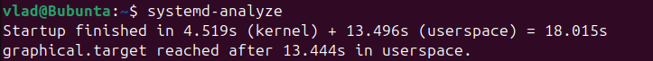
### 2. Выведите список всех запущенных при страте системы сервисов, в порядке уменьшения времени, затраченного на загрузку сервиса.

```sh
systemd-analyze blame
```
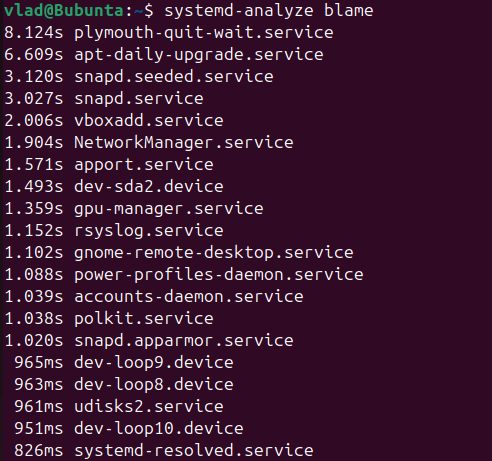
### 3. Выведите список сервисов, запуск которых с необходимостью предшествовал запуску сервиса sshd.

```sh
systemctl list-dependencies sshd.service --before
```
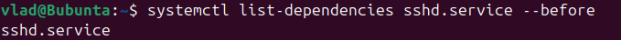
### 4. Сформируйте изображение в формате svg с графиком загрузки системы, сохраните его в файл.

```sh {"terminalRows":"1"}
systemd-analyze plot > boot_chart.svg
```
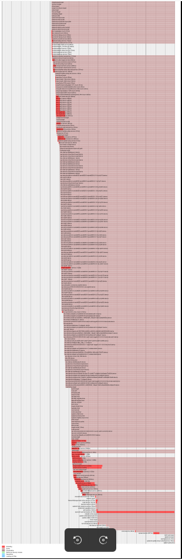

# Часть 2. Управление юнитами.

### 1.Получите список всех запущенных юнитов сервисов

```sh
systemctl list-units --type=service --state=running
```
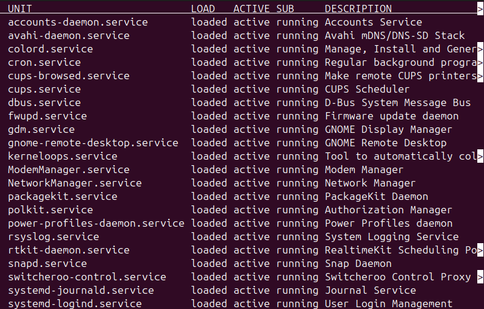
### 2. Выведите перечень всех юнитов сервисов, для которых назначена автозагрузка.

```sh
systemctl list-unit-files --type=service | grep 'enabled' | awk '{print $1}'
```
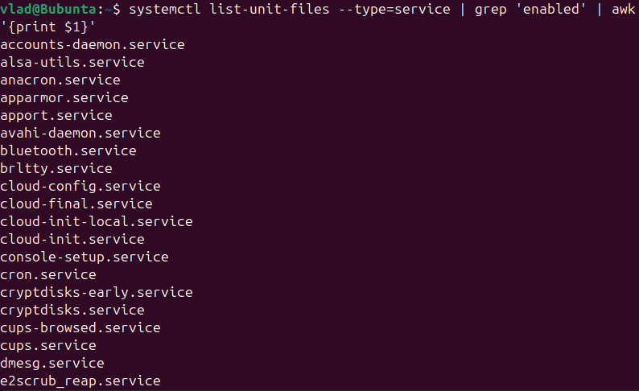
### 3. Определите от каких юнитов зависит сервис sshd.

```sh
systemctl list-dependencies sshd.service
```
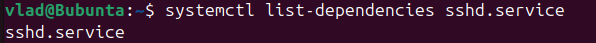
### 4. Определите запущен ли сервис cron, если нет, запустите его.

```sh {"terminalRows":"6"}
sudo systemctl is-active cron.service || sudo systemctl start cron.service
```
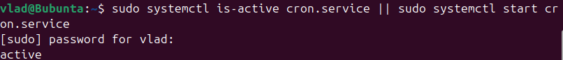
### 5. Выведите все параметры юнита cron, даже те, которые были назначены автоматически, и не были прописаны в файле юнита.

```sh
systemctl show cron.service
```
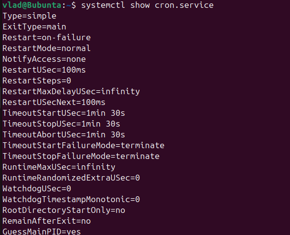
### 6. Запретите автозагрузку сервиса cron, но оставите ему возможность запускаться по зависимостям.

```sh {"terminalRows":"4"}
sudo systemctl stop cron.service
sudo systemctl disable cron.service
```
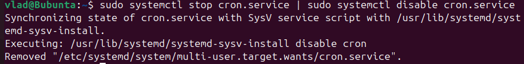
# Часть 3. Создание сервиса

1. Создайте собственный сервис mymsg. Сервис mymsg должен:  
   a. при старте системы записывать в системный журнал дату и время  
   b. должен запускаться только если запущен сервис network.

Создадим скрипт, который будет выполняться при запуске сервиса:

```sh {"terminalRows":"2"}
sudo nano /usr/local/bin/mymsg.sh
```

Добавим в него:
```sh {"terminalRows":"2"}
#!/bin/bash
logger "mymsg: Service started at $(date)"
```

```sh {"terminalRows":"6"}
cat /usr/local/bin/mymsg.sh
```

Создание файла юнита в /etc/systemd/system/mymsg.service

```sh {"terminalRows":"3"}
sudo nano /etc/systemd/system/mymsg.service
```

Его содержимое:

```sh
[Unit]
Description=My Message Service
After=network.target
Requires=network.target

[Service]
Type=oneshot
ExecStart=/usr/local/bin/mymsg.sh

[Install]
WantedBy=multi-user.target
```

Запуск сервиса:

```sh
sudo systemctl daemon-reload
sudo systemctl enable mymsg
sudo systemctl start mymsg
```

Получим результаты:
```sh
sudo systemctl status mymsg
journalctl | grep "mymsg"
```
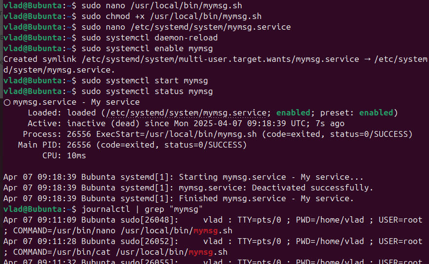
# Часть 4. Работа с системным журналом

1. Выведите на консоль системный журнал. Убедитесь, что сервис mymsg отработал корректно.

```sh
sudo journalctl
```
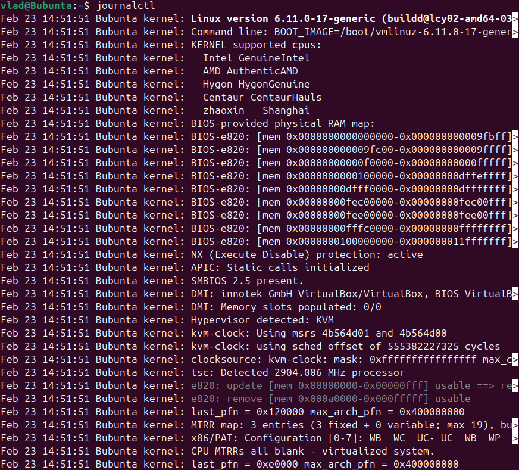
Чтобы просмотреть сообщения текущей загрузки, можно добавить флаг -b.

```sh
sudo journalctl -b
```

2. Выведите на консоль все сообщения системного журнала, касающиеся сервиса mymsg.

```sh
sudo journalctl -u mymsg.service
```
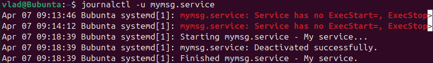
3. Выведите на экран все сообщения об ошибках в журнале.

```sh
journalctl -p err
```
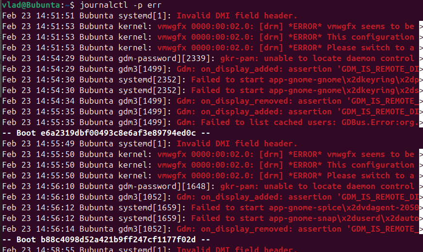
4. Определите размер журнала.

```sh {"terminalRows":"5"}
journalctl --disk-usage
```
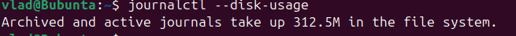
# Часть 5. Создание и настройка .mount юнита

1. Подготовьте файловую систему.  
   a. Создайте новый раздел на диске или используйте существующий.  
   b. Отформатируйте его в файловую систему ext4.  
   c. Создайте директорию для монтирования /mnt/mydata

```sh
sudo lsblk
```

```sh
sudo mkfs.ext4 /dev/sdb
```

```sh
sudo mkdir -p /mnt/mydata
```

2.Создание .mount юнита  
a. Создайте файл .mount юнита в /etc/systemd/system/mnt-mydata.mount.

    b.Настройте юнит следующим образом:  
        i. Добавьте описание юнита в секцию [Unit].  
        ii. В секции [Mount] укажите устройство, точку монтирования, тип файловой системы и опции.  
        iii. В секции [Install] укажите, что юнит должен быть активирован при достижении multi-user.target.  

c. Сохраните файл и выйдите из редактора.

Создание файла .mount юнита в /etc/systemd/system/mnt-mydata.mount

```sh {"terminalRows":"3"}
sudo nano /etc/systemd/system/mnt-mydata.mount
```

```sh {"terminalRows":"19"}
cat /etc/systemd/system/mnt-mydata.mount
```

3. Запуск и проверка .mount юнита  
   a. Включите и запустите юнит.  
   b. Проверьте статус юнита.  
   c. Убедитесь, что раздел смонтирован.

```sh {"terminalRows":"2"}
sudo systemctl enable mnt-mydata.mount
sudo systemctl start mnt-mydata.mount
```

```sh
systemctl status mnt-mydata.mount
```

```sh {"terminalRows":"2"}
mount | grep /mnt/mydata
```

# Часть 6. Использование .automount для отложенного монтирования

1. Подготовьте соответствующий .mount-юнит  
   a. После выполнения Части 5 у вас должен был остаться юнит для монтирования /mnt/mydata  
   b. Убедитесь, что при остановке раздел отмонтируется, а монтируется обратно только при запуске юнита или перезагрузке системы

```sh {"terminalRows":"7"}
sudo systemctl stop mnt-mydata.mount
mount | grep -q /mnt/mydata && echo true || echo false

#sudo systemctl start mnt-mydata.mount
#mount | grep /mnt/mydata
```

2. Создание .automount юнита  
   a. Создайте файл .automount юнита в /etc/systemd/system/mnt-mydata.automount.

   b. Настройте юнит:  
   i. В секции [Unit] добавьте описание.  
   ii. В секции [Automount] укажите точку монтирования и время до размонтирования (TimeoutIdleSec).  
   iii. В секции [Install] укажите, что юнит должен быть активирован при достижении multi-user.target.

c. Сохраните файл и выйдите из редактора.

Создание файла .automount юнита в /etc/systemd/system/mnt-mydata.automount

```sh {"terminalRows":"6"}
sudo nano /etc/systemd/system/mnt-mydata.automount
```

```sh
cat /etc/systemd/system/mnt-mydata.automount
```

3. Запуск и проверка .automount юнита  
   a. Включите и запустите .automount юнит.  
   b. Проверьте статус юнита и убедитесь, что раздел монтируется при обращении к точке монтирования.  
   c. Убедитесь, что раздел размонтируется после завершения работы.

```sh {"terminalRows":"4"}
sudo systemctl enable mnt-mydata.automount
```

```sh {"terminalRows":"3"}
sudo umount /mnt/mydata
sudo systemctl start mnt-mydata.automount
```

```sh
sudo systemctl status mnt-mydata.automount
```

Проверка автоматического монтирования, обратившись к точке:

```sh
ls /mnt/mydata
```

После периода бездействия (30 секунд) проверяем, что раздел отмонтировался:

```sh
mount | grep /mnt/mydata
```