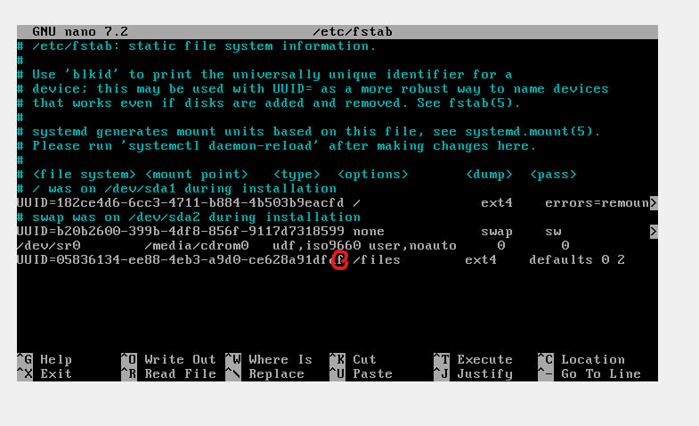

При запуске в recovery mod получаю ошибку с графическими драйверами, поэтому запускаю систему следующим образом:
нажимаю e при запуске GRUB и меняю quiet на init=/bin/bash то есть меняю параметры запуска прямо при старте GRUB.
# С большим удовольствием сравниваем UUID дисков
ТК основная система не доходит даже до выбора пользователей и вообще никак не стартится, я предположил, что проблема с дисками
#### переходим в монтируемый режим 
```sh
mount -o remount,rw /
```

#### переходим в /etc/fstab
```shell
nano /etc/fstab
```

### И, о чудо, находим проблему в UUID в одну букву 
(сравнивали с результатом вывода ```blkid```)



### Решаем проблему с загрузкой графики 
```shell
systemctl get-default  
```

выводит graphical.target

```shell
systemctl set-default multi-user.target  
```

### Обновление GRUB

```bash
nano /etc/default/grub  
```

меняем 

```GRUB_CMDLINE_LINUX_DEFAULT="quiet splash nomodeset"  ```

```shell
update-grub  
```

на всякий проверяем диски

```shell
fsck -f /dev/sda1  
fsck -f /dev/sda3  
journalctl -b -p err
```

ошибок нет
